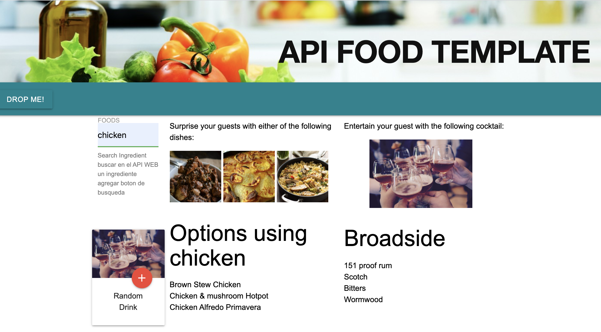

# Unit 7: Project 1 - API FOOD TEMPLATE

## Overview
Our team worked on this project with the intention of applying several key concepts we have learned during these 1st weeks of the bootcamp training.

We looked forward to incorporate the following topics:

## Key Topics
* Server-side APIs
* Git branching workflow
* Agile software development

## API FOOD TEMPLATE
Our API Food template was designed thinking of a party host, who is looking for variety of ideas regarding what to serve for food and cocktails in order to entertain his / her guests.

### Home Page
The left section will serve as the search input and random drink generator.
The center section will display 3 food alternatives based on the ingredient the user typed in. If the ingredient didn`t return any response from the API, the website will give an error message.
The right section will display the random suggeted cocktail to be served.

### User Story
In this section, we wanted to summarize the user story that drove the excecution of this project.

### FOOD API link
This link will take you to the following website:
* [The Meal DB](https://www.thecocktaildb.com/api.php)

### Drink API Link
This link will take you to following website:
* [The Cocktail DB](https://git-scm.com/book/en/v2/Git-Branching-Branching-Workflows)

### API Video
In this section, we added a video API and a list of ingredients.
The idea is for the user to take notes of the ingredientes listed in the video and save them to the local storage.

### About us
We added some links to our first homework (our personal webprofiles) so visitors will be able to reach us.
More than glad to hear your feedback.

## Challenges that we faced
* The main challenge was learning who to use, collaborate and interact using GitHub. This certainly was a very valuable experience for all of us.

* The other challenge we faced was trying to focus on functionalities linked to the user story.

* Learning other css alternatives other than Bootstrap.

As we all provided great, fun, creative and exciting ideas; at some point we realized that we needed to keep a balance between our vision and the project requirements in order to deliver on time.

## Vision Product
In our vision project, we would add a search input to the API video so that user can look for recipies based on an ingredient filter and get a video with the explanation on how to prepare that meal.

